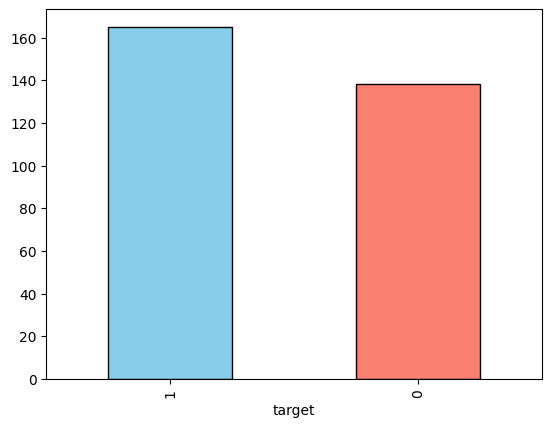
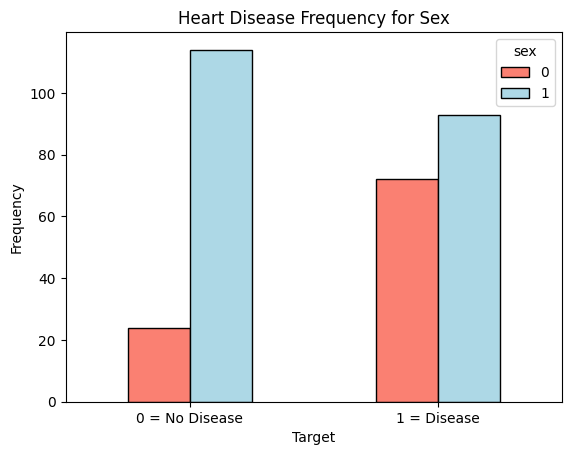
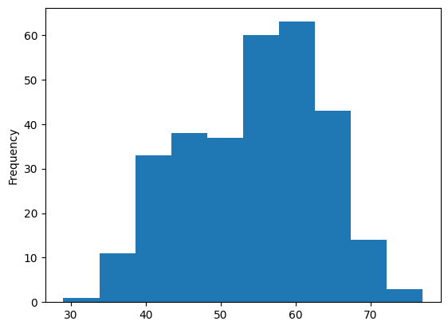
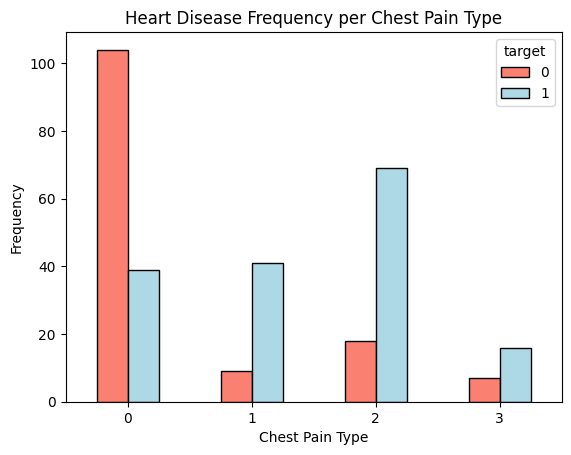
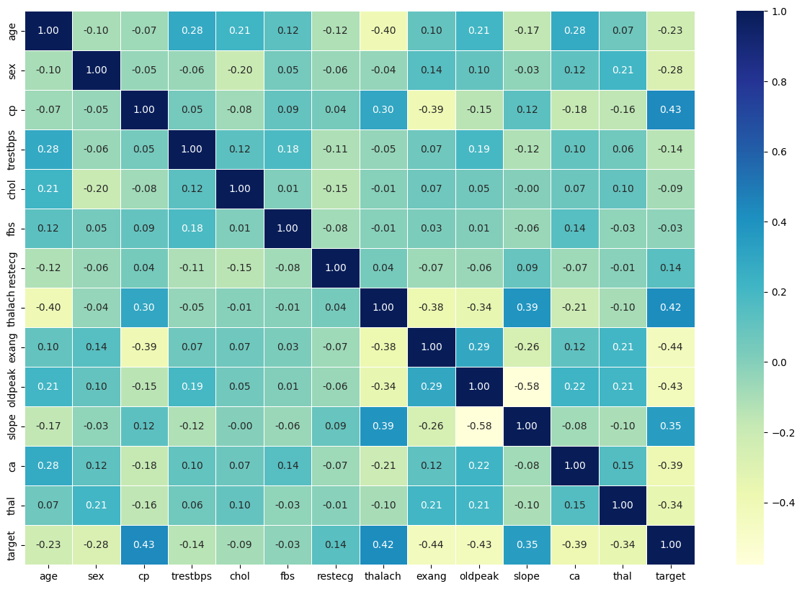
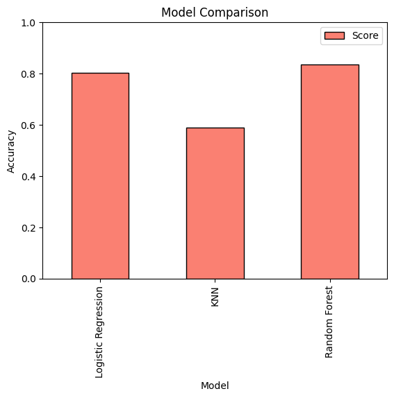
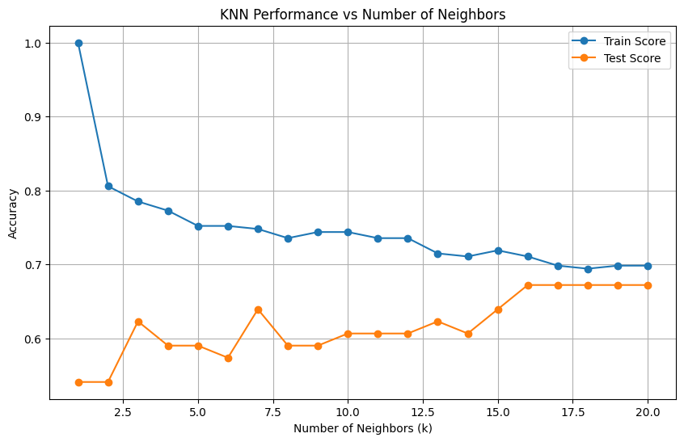
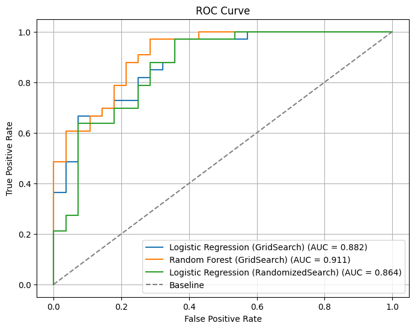
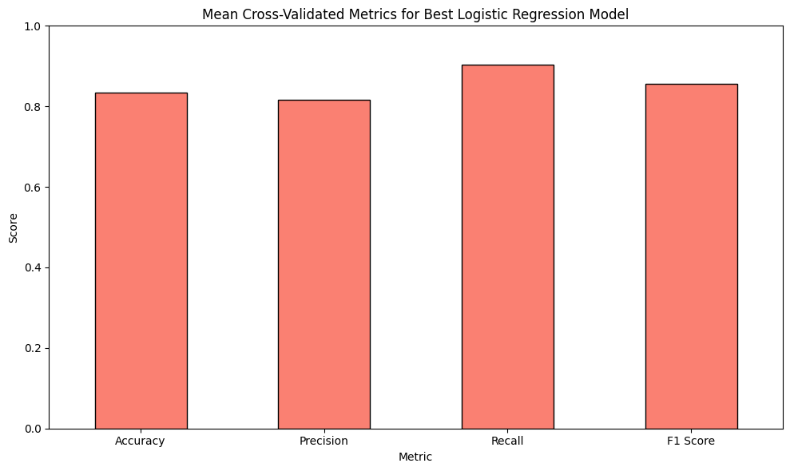
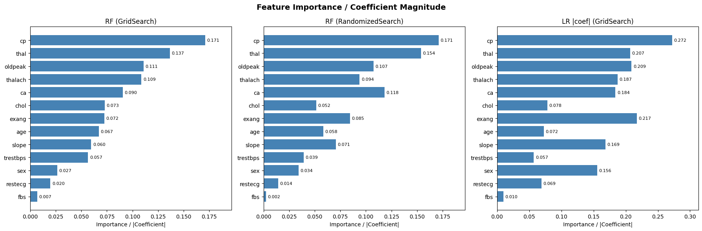

# Heart Disease Detection

This project explores how Python-based machine learning and data science libraries can be used to build an ML model that predicts whether or not someone has heart disease.

## Overview

The analysis follows a structured workflow:

1. **Problem Definition** – Can we predict whether a patient has heart disease based on clinical features?
2. **Data** – The [Cleveland Heart Disease dataset](https://archive.ics.uci.edu/ml/datasets/Heart+Disease) with 303 patients and 14 features.
3. **Evaluation** – Target: ≥ 95% accuracy at predicting heart disease.
4. **Features** – Age, sex, chest pain type, resting blood pressure, cholesterol, fasting blood sugar, resting ECG, max heart rate, exercise-induced angina, ST depression, ST slope, number of major vessels, and thalassemia.
5. **Modelling** – Logistic Regression, K-Nearest Neighbours, and Random Forest classifiers.
6. **Experimentation** – Hyperparameter tuning with `RandomizedSearchCV` and `GridSearchCV`.

## Files

| File | Description |
|------|-------------|
| `heart_disease.ipynb` | Main Jupyter notebook with full analysis |
| `heart-disease.csv` | Dataset (303 rows × 14 columns) |

## Example Visualizations

### Target Distribution
Distribution of patients with and without heart disease.

### Heart Disease by Sex
Breakdown of heart disease diagnoses by biological sex (0 = female, 1 = male).

### Age vs Maximum Heart Rate
Scatter plot showing the relationship between age and maximum heart rate, coloured by diagnosis.

### Age Distribution
Histogram of patient ages in the dataset.

### Chest Pain Type vs Target
Breakdown of heart disease diagnoses by chest pain type (0–3).

### Correlation Heatmap
Pairwise correlation between all numeric features.

### Model Comparison
Baseline accuracy scores for Logistic Regression, KNN, and Random Forest.

### KNN — Train vs Test Scores
Train and test accuracy for different values of *k* in K-Nearest Neighbours.

### ROC Curve
Receiver Operating Characteristic (ROC) curve for the tuned classifier.

### Cross-Validation Metrics
Mean accuracy, precision, recall, and F1 score from 5-fold cross-validation.

### Feature Importance
Feature importances from the tuned Random Forest classifier.

## Libraries Used

- `pandas`, `numpy` – data manipulation
- `matplotlib`, `seaborn` – visualisation
- `scikit-learn` – modelling and evaluation
